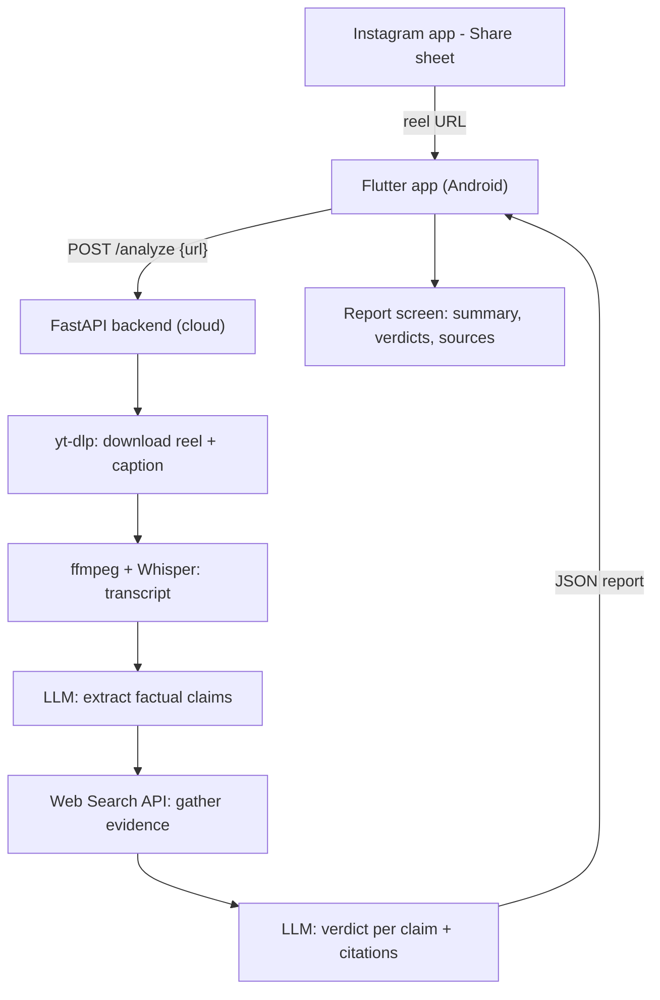

# Instagram Video Fact-Checker (Flutter + Cloud Backend)

## Goal
User shares an Instagram reel to the app via the Android share sheet. The app sends the link to a backend that understands the video, researches its claims, and returns a summary stating whether the claims are true, false, or misleading, with sources.

## Architecture

## Tech choices (decided)
- App: Flutter (Android first), input via Android share sheet only.
- Backend: Python FastAPI, hosted in the cloud (keeps API keys secret).
- AI: an LLM (GPT/Claude class) for claim extraction + verdicts, plus a web search API for evidence.

## Recommended specific stack (can swap)
- Video download: `yt-dlp` (handles Instagram reels + caption metadata).
- Transcription: OpenAI Whisper API (or local `faster-whisper` to cut cost).
- LLM: GPT-4o / Claude 3.5 (structured JSON output for claims + verdicts).
- Search: Tavily API (built for LLM fact research; alternatives: Brave Search, Perplexity, SerpAPI).
- Deploy: Docker container on Railway/Render/Fly.io (image must include `ffmpeg` + `yt-dlp`).

## Important constraints to flag up front
- Instagram has no official API for downloading arbitrary videos. `yt-dlp` scrapes public reels and may break or hit rate limits; private/login-gated reels will not work. This is the biggest technical risk and a possible ToS concern - fine for a personal/prototype app, needs review before public release.
- Because of this, all download logic lives on the backend so it can be updated without app releases.

## Data contract (app <-> backend)
- Request: `POST /analyze` with `{ "url": "https://www.instagram.com/reel/..." }`
- Response:
  - `overall_summary`: 2-3 sentence plain-language summary of the video.
  - `overall_verdict`: one of `true` / `mostly_true` / `mixed` / `misleading` / `false` / `unverifiable`.
  - `claims[]`: each with `claim_text`, `verdict`, `explanation`, `sources[] {title, url}`.

## Phase 1 - Backend pipeline (build/test standalone first)
- Scaffold FastAPI project with `POST /analyze`.
- Integrate `yt-dlp` to fetch the reel video + caption text into a temp dir.
- Use `ffmpeg` to extract audio; transcribe with Whisper.
- Combine caption + transcript, prompt LLM to extract discrete factual claims (structured JSON).
- For each claim, call the search API; feed results back to the LLM for a per-claim verdict + citations.
- Aggregate into the response contract above. Add basic error handling (bad URL, private reel, download failure) and a request timeout.

## Phase 2 - Flutter app
- New Flutter project targeting Android.
- Add `receive_sharing_intent` to register as a share target for text/URLs so Instagram "Share -> [app]" delivers the reel URL.
- Screens: Home/empty state -> Loading (with progress messaging, since analysis takes ~15-40s) -> Report screen rendering summary, color-coded verdict badges, expandable claims, and tappable source links.
- HTTP client (`dio`/`http`) to call the backend; handle timeouts and error states gracefully.

## Phase 3 - Deploy + connect
- Dockerize backend (base image + `ffmpeg` + `yt-dlp` + Python deps), deploy to chosen host, set API keys as env vars.
- Point the app at the deployed URL; test end-to-end with real reels.

## Phase 4 (optional, later)
- Caching by reel ID to avoid re-analyzing.
- History screen of past checks (local storage / SQLite).
- iOS support (Flutter already cross-platform; share extension needed).
- Auth + rate limiting to protect backend cost.

## Open items (current defaults)
- LLM provider: default OpenAI GPT-4o (swap to Claude/Gemini is a config change).
- Search provider: default Tavily.
- Host: default Railway (simplest for Docker + always-on).

## Build checklist
- [ ] Scaffold FastAPI backend with POST /analyze endpoint and response schema
- [ ] Integrate yt-dlp to download Instagram reel video + caption to temp storage
- [ ] Extract audio with ffmpeg and transcribe with Whisper
- [ ] LLM prompt to extract discrete factual claims from caption + transcript (structured JSON)
- [ ] Per-claim web search (Tavily) + LLM verdict with citations; aggregate into report
- [ ] Add error handling (private/invalid reel, download failure), timeouts, logging
- [ ] Create Flutter Android project and app skeleton
- [ ] Add receive_sharing_intent so app appears in Instagram share sheet and receives reel URL
- [ ] Build Home/Loading/Report screens with verdict badges, claims, and source links
- [ ] Wire app to backend /analyze with loading + error states
- [ ] Dockerize backend with ffmpeg + yt-dlp and deploy to cloud host with env-var keys
- [ ] Connect app to deployed backend and test end-to-end with real reels
