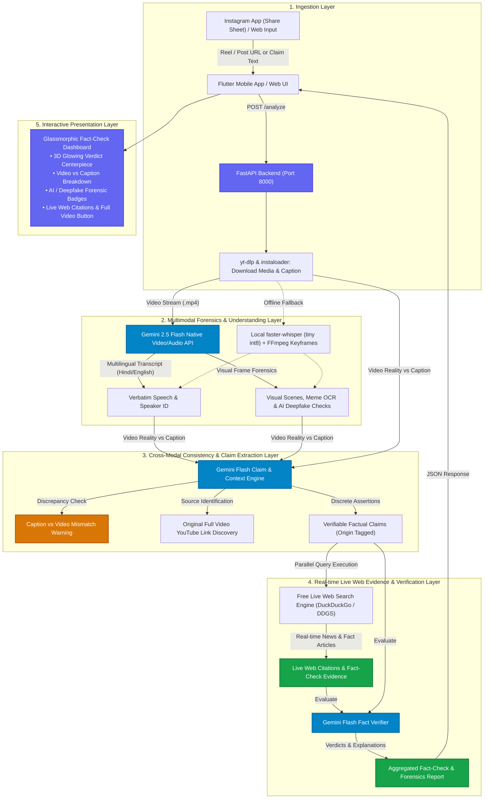

# 🔍 InstaFactCheck — Instagram Video & Post Fact-Checker

[](https://render.com/deploy?repo=https://github.com/shubhansujee9/InstaFactCheck)

An end-to-end AI fact-checking application that analyzes Instagram Reels, video posts, and carousel/photo posts. It downloads content, transcribes speech, extracts discrete factual assertions using an LLM, verifies evidence, and returns an interactive fact-check report with color-coded verdict badges, explanations, and citations.


---

## 🏗️ System Architecture



---

## ⚡ Tech Stack & Capabilities

- **Backend**: Python 3.11, FastAPI, Uvicorn, Pydantic v2
- **Multimodal Video & Audio Engine**: Google Gemini 2.5 Flash (`google.generativeai` / `google.genai`)
- **Claim Extraction & Fact Verification**: Google Gemini Flash Latest (`gemini-flash-latest` via OpenAI compatibility)
- **Zero-Key Live Web Search**: `ddgs` / `duckduckgo-search` (Real-time live news and fact-check citations)
- **Local Fallback Speech Transcription**: `faster-whisper` (Running `tiny` int8 model locally on CPU)
- **Media Downloaders & Video Processing**: `yt-dlp`, `ffmpeg`, `instaloader`
- **Mobile Client**: Flutter 3.x (Material 3 dark design, Android Share Sheet receiver via `receive_sharing_intent`)
- **Web Client**: Modern Glassmorphic Dark Dashboard with responsive radial gradients and micro-animations
- **Cloud Deployment**: 1-Click Render Docker blueprint (`render.yaml`) & Cloudflare Tunnels (`cloudflared`)

---

## 🚀 Quick Start

### 1. Backend Setup

```bash
cd backend

# Create virtual environment
python3 -m venv .venv
source .venv/bin/activate

# Install dependencies
pip install -r requirements.txt

# Configure environment variables
cp .env.example .env
```

Edit `.env` with your API configuration:
```env
OPENAI_API_KEY=your_key_or_omniroute_key
OPENAI_BASE_URL=http://localhost:20128/v1
OPENAI_MODEL=auto/best-chat
```

Run the backend server:
```bash
uvicorn app.main:app --reload --host 0.0.0.0 --port 8000
```

- **Web UI**: Open [http://localhost:8000](http://localhost:8000)
- **Interactive Swagger Docs**: [http://localhost:8000/docs](http://localhost:8000/docs)

---

### 2. Flutter Mobile App Setup

```bash
cd flutter_app

# Install dependencies
flutter pub get

# Run on connected Android device or emulator
flutter run
```

---

### 3. Docker Deployment

```bash
cd backend
docker-compose up --build
```

---

## 📋 Data Contract (`POST /analyze`)

### Request
```json
{
  "url": "https://www.instagram.com/reel/DcoihYFhlOO/"
}
```
*or direct claim text:*
```json
{
  "text": "Eating raw onions cures bacterial infections within 2 hours without antibiotics."
}
```

### Response
```json
{
  "overall_summary": "This video contained 5 verifiable claims. Of these, 4 verified as true, 1 mostly true.",
  "overall_verdict": "mostly_true",
  "claims": [
    {
      "claim_text": "Ravi Kishan is a Member of Parliament representing the BJP.",
      "verdict": "true",
      "explanation": "Ravi Kishan serves as an MP in the Lok Sabha representing the Gorakhpur constituency.",
      "sources": [
        {
          "title": "Members : Lok Sabha",
          "url": "https://sansad.in/ls/members"
        }
      ]
    }
  ],
  "video_title": "Video by unscripted.india_",
  "transcript_snippet": null
}
```

---

## 🛡️ License
MIT License
